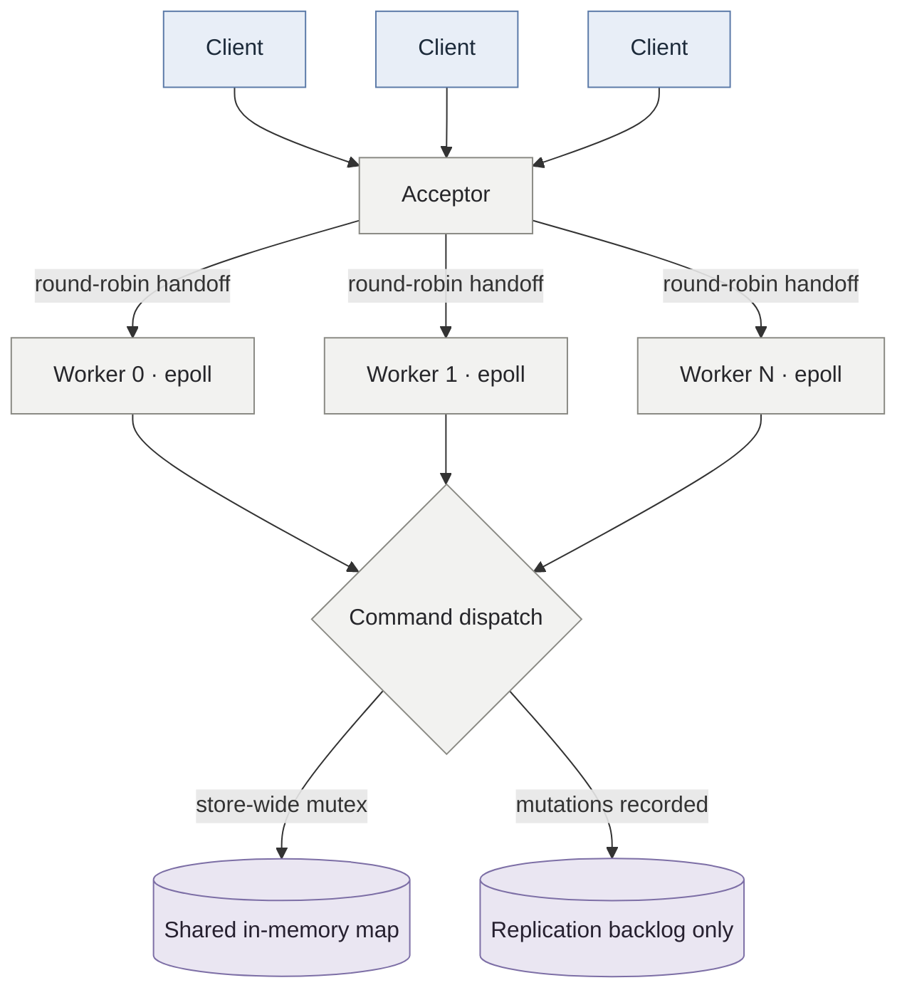

# kvstore

A Redis-inspired, single-node in-memory key-value store in C++20, with a custom binary
TCP protocol and a multithreaded, epoll-based Linux server. Replication is not implemented;
the project is not yet a distributed store.

Built as a systems project to work through non-blocking I/O, protocol correctness,
concurrent access, expiration, and memory-pressure behavior.

**Status:** packaging/docs are complete; replication and hardening remain in progress. See
[STATUS.md](STATUS.md) for shipped functionality and [PLAN.md](PLAN.md) for the target roadmap.

**Live demo:** [kv-store-console.vercel.app](https://kv-store-console.vercel.app) ·
[Railway API health](https://kvstore-demo-production.up.railway.app/health) · Public,
ephemeral demo sessions — do not store secrets.

Each browser session receives an isolated demo namespace and starts with two example keys.
Use **New demo** to get a fresh namespace. Values live only in process memory, so a Railway
restart clears them; the public demo is for trying the UI, not production data.

---

## Features

- **Custom binary protocol** — length-prefixed frames, no text scanning, pipelining supported
- **epoll event loop per worker thread** — edge-triggered, non-blocking; connections are not threads
- **Shared in-memory map** — protected by a store-wide mutex; operations are thread-safe but serialize on that lock
- **TTL** — expired keys are removed lazily during store operations; there is no background expiry cycle
- **Memory policies** — approximate key/value byte accounting; `noeviction` rejects writes over the configured limit and `allkeys-lru` evicts the least recently used entry
- **Client tools** — interactive CLI, concurrent stress client, and closed-loop latency/throughput benchmark
- **Replication groundwork** — a bounded in-process backlog records recent mutations, but there is no follower protocol, synchronization, or failover

Commands: `GET SET DEL EXISTS INCR DECR EXPIRE TTL PERSIST KEYS [prefix] INFO PING`.
`REPLICAOF` is recognized but returns an explicit not-implemented error.

The memory limit accounts for key and value sizes plus a small fixed estimate, not total
process RSS. The LRU policy scans and sorts candidate entries while holding the store lock.

## Build

```bash
cmake -B build -DCMAKE_BUILD_TYPE=Release
cmake --build build -j
ctest --test-dir build
```

Requires a C++20 compiler (GCC 12+ / Clang 15+) and Linux — the server depends on `epoll`.

## Packaging and CI

```bash
# build the container image
podman build -t kvstore .
# or
docker build -t kvstore .

# run the HTTP gateway in public demo mode
docker run --rm -p 8080:8080 \
  -e DEMO_SECRET=<long-random-secret> \
  -e WEB_ORIGINS=http://localhost:5173 \
  kvstore
```

The repository includes a Docker image and local build presets for repeatable testing and
packaging work. The architecture walkthrough is published in [docs/index.html](docs/index.html).

## Web console deployment


[Watch the short MP4 demo](docs/demo.mp4).

The web console is a separate Vercel project rooted at `web/`. Its HTTP API gateway and the
C++ store run together in the Railway container; the C++ TCP listener is bound to loopback
and is not exposed publicly. The public demo uses signed per-browser sessions to keep each
visitor's keys separate. Demo sessions are public and intended for testing, not for storing
secrets. Sessions and their keys expire after one hour; the key/value data remains in memory
and is also lost when the Railway process restarts or a key is evicted.

### Railway

Deploy the repository root using its `Dockerfile`, then set these service variables:

```text
WEB_ORIGINS=https://<your-vercel-domain>,http://localhost:5173
DEMO_SECRET=<long-random-secret>
```

Railway provides `PORT`; the gateway uses it automatically. Generate `DEMO_SECRET` with a
password manager or `openssl rand -hex 32`. `KV_MAXMEMORY` can be set to adjust the default
512 MiB store limit. The gateway trusts one reverse-proxy hop when determining client IPs
for rate limits, so keep it behind Railway's ingress rather than exposing it directly.

### Vercel

Import this GitHub repository, set the project root directory to `web`, and add:

```text
VITE_API_URL=https://<your-railway-domain>
```

Deploy, then update Railway's `WEB_ORIGINS` to the exact Vercel production origin and
redeploy the Railway service. The web app provides separate demo sessions, live key listing,
create/update/delete, and optional TTL. Sessions last one hour and are limited to 50 keys
and 16 KB per value. For local UI development, copy `web/.env.example` to `web/.env.local`
and update
its API URL. Run `kvserver` locally, copy `gateway/.env.example` to `gateway/.env`, set
`START_KV_SERVER=false`, then run `npm start` from `gateway/` and `npm run dev` from `web/`
in separate terminals.

## Run

```bash
./build/kvserver --port 6380 --threads 4 --maxmemory 512mb --maxmemory-policy allkeys-lru

# client
./build/kvcli -p 6380
> SET session:91af "value with spaces"
OK
> EXPIRE session:91af 300
(integer) 1
> TTL session:91af
(integer) 300
```

## Architecture



The acceptor hands non-blocking sockets to workers through per-worker event queues.
Each worker uses edge-triggered epoll and owns its connection buffers. The store itself
uses one mutex; the backlog is only an in-process record and does not feed a follower.

## Protocol

Length-prefixed, little-endian, one request per frame:

```
request  : [u32 nargs] ([u32 len][bytes])*
response : [u32 total][u8 type][payload]
           0 NIL   1 ERR   2 STR   3 INT   4 ARR
```

Framing is fixed-width, so the parser never scans for delimiters and a partial read is
resumed from the byte offset it stopped at. Arrays contain a `u32` item count followed by
length-prefixed items. Requests are limited to 64 arguments and 16 MiB per frame.

The implementation and remaining milestones are tracked in [STATUS.md](STATUS.md); the
broader target architecture is described in [PLAN.md](PLAN.md).

## Repository layout

```
src/server/  acceptor, epoll worker loops, command dispatch
src/proto/   frame codec
src/store/   shared map, memory policy, lazy expiry
src/repl/    mutation backlog groundwork only
src/cli/     interactive client
tests/  bench/  docs/
```

## License

No `LICENSE` file is currently included; reuse terms are not specified in this repository.
