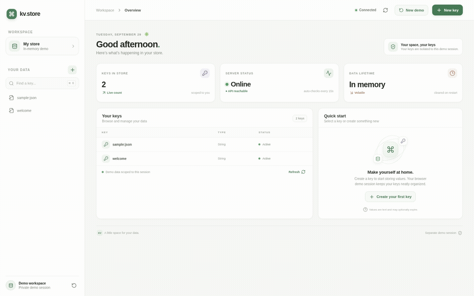
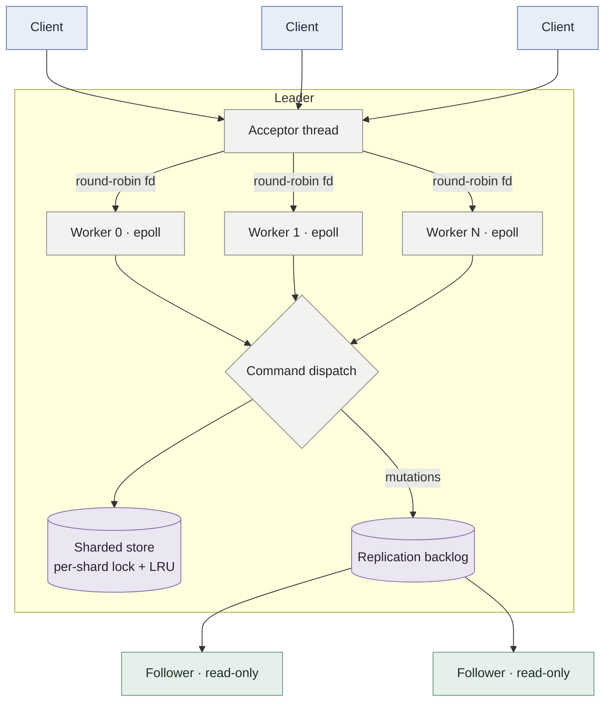
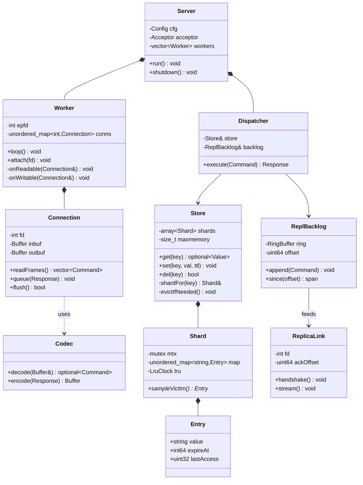
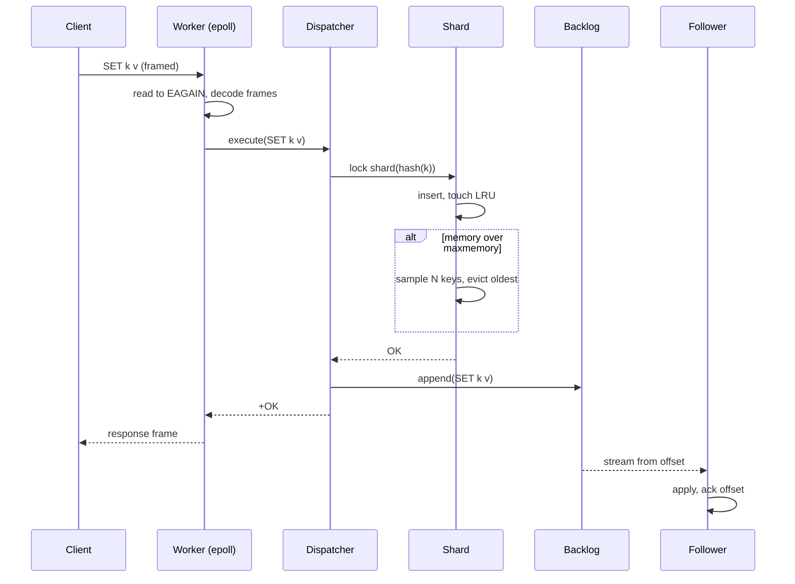
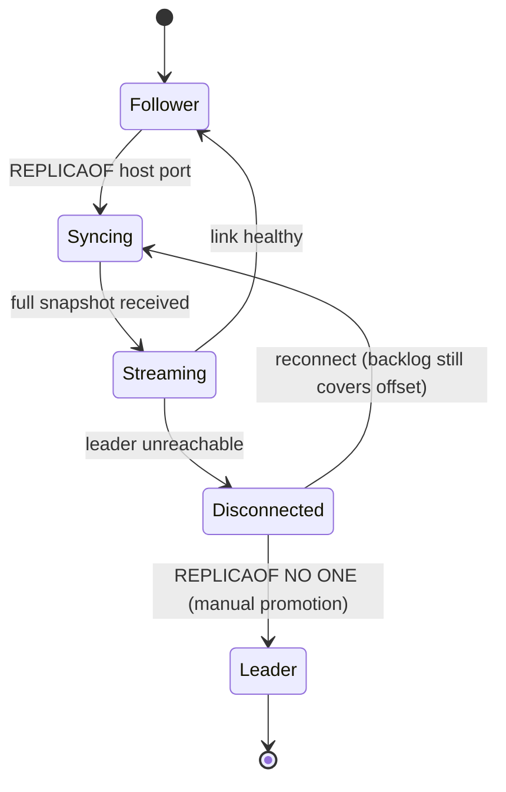

# kvstore

A distributed in-memory key-value store in C++20 — Redis-inspired, with a custom binary
TCP protocol, an epoll-based multithreaded server, LRU eviction, and leader-follower
replication.

Built as a systems project to work through the things a cache actually has to get right:
non-blocking I/O at scale, lock granularity, bounded memory, and staying available when a
node dies.

**Status:** M7 of 7 — see [STATUS.md](STATUS.md). Design and roadmap in [PLAN.md](PLAN.md).
The repository includes the packaging, CI, and design-page deliverables for the final milestone.

**Live demo:** [kv-store-console.vercel.app](https://kv-store-console.vercel.app) ·
[Railway API health](https://kvstore-demo-production.up.railway.app/health) · Public,
ephemeral demo sessions — do not store secrets.

Each browser session receives an isolated demo namespace and starts with two example keys.
Use **New demo** to get a fresh namespace. Values live only in process memory, so a Railway
restart clears them; the public demo is for trying the UI, not production data.

---

## Features

- **Custom binary protocol** — length-prefixed frames, no text scanning, pipelining supported
- **epoll event loop per worker thread** — edge-triggered, non-blocking; connections are not threads
- **Sharded keyspace** — per-shard mutex and LRU, so hot keys don't serialize the whole store
- **TTL** — lazy expiry on access plus an active sampling cycle
- **LRU eviction** — approximate, Redis-style sampling under a `maxmemory` cap (`allkeys-lru` policy supported)
- **Bench harness** — a stress client for concurrent request bursts and throughput baselines
- **Replication backlog** — mutating commands are logged for stream-based follower replay and failover work
- **Leader-follower replication** — async command streaming, read-only followers, manual promotion

Commands: `GET SET DEL EXISTS INCR DECR EXPIRE TTL PERSIST KEYS INFO REPLICAOF PING`

## Build

```bash
cmake -B build -DCMAKE_BUILD_TYPE=Release
cmake --build build -j
ctest --test-dir build
```

Requires a C++20 compiler (GCC 12+ / Clang 15+) and Linux — the server depends on `epoll`.

## Packaging and CI

```bash
# build the container image
podman build -t kvstore .
# or
docker build -t kvstore .

# run the HTTP gateway in public demo mode
docker run --rm -p 8080:8080 \
  -e DEMO_SECRET=<long-random-secret> \
  -e WEB_ORIGINS=http://localhost:5173 \
  kvstore
```

The repository includes a Docker image and local build presets for repeatable testing and
packaging work. The architecture walkthrough is published in [docs/index.html](docs/index.html).

## Web console deployment



[Watch the short MP4 demo](docs/demo.mp4).

The web console is a separate Vercel project rooted at `web/`. Its HTTP API gateway and the
C++ store run together in the Railway container; the C++ TCP listener is bound to loopback
and is not exposed publicly. The public demo uses signed per-browser sessions to keep each
visitor's keys separate. Demo sessions are public and intended for testing, not for storing
secrets. The key/value data remains in memory and is lost when the Railway process restarts
or a key is evicted.

### Railway

Deploy the repository root using its `Dockerfile`, then set these service variables:

```text
WEB_ORIGINS=https://<your-vercel-domain>,http://localhost:5173
DEMO_SECRET=<long-random-secret>
```

Railway provides `PORT`; the gateway uses it automatically. Generate `DEMO_SECRET` with a
password manager or `openssl rand -hex 32`. `KV_MAXMEMORY` can be set to adjust the default
512 MiB store limit.

### Vercel

Import this GitHub repository, set the project root directory to `web`, and add:

```text
VITE_API_URL=https://<your-railway-domain>
```

Deploy, then update Railway's `WEB_ORIGINS` to the exact Vercel production origin and
redeploy the Railway service. The web app provides separate demo sessions, live key listing, create/update/delete, and
optional TTL. Sessions are limited to 50 keys and 16 KB per value. For local UI development,
copy `web/.env.example` to `web/.env.local` and update
its API URL. Run `kvserver` locally, copy `gateway/.env.example` to `gateway/.env`, set
`START_KV_SERVER=false`, then run `npm start` from `gateway/` and `npm run dev` from `web/`
in separate terminals.

## Run

```bash
# leader
./build/kvserver --port 6380 --threads 4 --maxmemory 512mb --maxmemory-policy allkeys-lru

# follower
./build/kvserver --port 6381 --replicaof 127.0.0.1 6380

# client
./build/kvcli -p 6380
> SET session:91af '{"user":17}'
OK
> EXPIRE session:91af 300
(integer) 1
> TTL session:91af
(integer) 300
```

## Architecture



### Class model



### Request path



### Failover



## Protocol

Length-prefixed, little-endian, one request per frame:

```
request  : [u32 nargs] ([u32 len][bytes])*
response : [u32 total][u8 type][payload]
           0 NIL   1 ERR   2 STR   3 INT   4 ARR
```

Framing is fixed-width, so the parser never scans for delimiters and a partial read is
resumed from the byte offset it stopped at.

## Design notes

**Why one epoll loop per thread rather than a shared loop?** A single loop with a thread
pool behind it needs a handoff queue and a wakeup per event. Pinning each connection to a
worker keeps the connection's buffers in that thread, so nothing about the socket needs a
lock.

**Why sharded locks rather than one global mutex?** The store is the only shared state.
Splitting it into `2^k` independently locked shards turns a single contention point into
`2^k` of them, and hashing spreads keys evenly. The tradeoff is that cross-key atomicity
would need multi-shard locking in a fixed order.

**Why approximate LRU?** An exact LRU list means every read mutates a shared list, turning
reads into writes. Sampling a handful of keys and evicting the oldest gets close to true
LRU at a fraction of the cost — the same tradeoff Redis makes.

## Repository layout

```
src/net/     sockets, epoll loop, buffers
src/proto/   frame codec
src/store/   sharded map, LRU, expiry
src/repl/    backlog, leader feeder, follower client
src/server/  config, worker pool, dispatch
src/cli/     interactive client
tests/  bench/  docs/
```

## License

MIT
